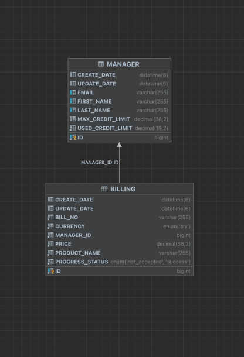

## Accounting microservice

Project written with java 21 + Spring Boot 3.3.5 <br>

Tech:
<b>

- Mysql
- Redis (for distributed locking)
- Flyway
- Docker (with Volumes)
- Testcontainers
- Open Api
  </b>

Project Architecture Contents:

- DDD with Hexagonal Architecture

This service have a 6 endpoint ;

1. **POST /managers** for create new accounting manager

2. **GET /managers/{accountingManagerId}** for get saved accounting manager by Id

3. **PUT /managers/{accountingManagerId}** for update accounting manager max credit limit by Id

4. **POST /billings** for create new billing

5. **GET /billings/{billingId}** for get saved billing

6. **GET /billings?progressStatus={progressStatus}&accountingManagerId={accountingManagerId}** for
   get saved billing with progressStatus and optional accountingManagerId

Project have Swagger-ui you can test it in our browser by
visiting http://localhost:8080/swagger-ui/index.html

Accounting managers and billings stored in mysql database (dockerized + volume )

When a new Accounting manager is saved, the max credit limit is taken from the env file. if you want
update max credit limit call 3. endpoint with new limit.

Build :

Firstly delete module base pom.xml and build. After delete module in module's pom.xml and build
domain,infra. After building all modules, re-add modules to poms and build all project

For run project ;

1. With Docker :
    - Compile project with Java 21
    - Run with Docker comments , go to project folder and run this commands:

    ```
    $ docker build -t accounting-api-image .
    $ docker-compose -f docker-compose.yaml up -d
    ```
2. With IDE  :
    - Firstly you must be run mysql in docker
    - add your host file 0.0.0.0 accounting-mysql and 0.0.0.0 accounting-redis
    - Run mysql in docker-compose.yaml file and run java project

Project have %90 method coverage with unit test;

- Usage ;
    - First of all create a accounting manager with 1. endpoint and service will return saved
      accounting manager with id.
    - Call 4. endpoint with your billing data and account manager id. This service will return
      success or not accepted status.
    - You see ,if you are billing a product that does not exceed the accounting manager's purchase
      limit: success, else not accepted status.
    - İf you want update accounting manager's max credit limit call 3. endpoint with id and new max
      credit limit.
    - accounting manager's max credit limit default value is 200.00 TRY
    - İf you want see get all billing by progressStatus and optional accountingManagerId call
      6.endpoint

-Postman Collection

- Collection generated with swagger-api if you are change project controller,u can change postman
  collection with http://localhost:8080/v3/api-docs

-Curl Command

- You can see curl command in http://localhost:8080/swagger-ui/index.html

-Database Schema
